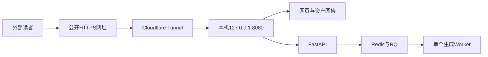
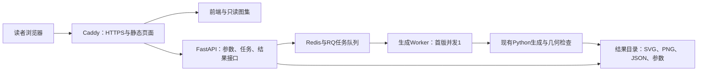

# Paper A 公开演示网站：实现与部署规划

日期：2026-09-20。当前状态：完整网站已在Windows本机运行，并已通过Cloudflare Quick Tunnel进行公网生成与下载测试。尚未购买服务器或固定域名。**当前操作以 `web/CLOUDFLARE.md` 为准；下文Docker/Redis等为早期及后续云端规划，当前运行采用原生Python、SQLite队列和单生成进程。**

实施记录：当前本地版采用React/Vite、FastAPI、SQLite持久队列和隔离Python生成进程，以便在现有Windows环境直接运行；Redis/RQ与云端容器是原规划的后续部署选项。本地启动说明及已实现功能见 `../web/README.md`（从仓库根目录访问 `web/README.md`）。已通过六原型HTTP生成、固定花藤对照、指定数量、图集筛选和文件下载检查。公开运行的限流、清理策略与域名接入在部署阶段完成。

作者条件：尚无服务器和域名，优先低成本部署。现有数据与代码继续保存在本仓库，以普通文件维护，不制作压缩交付包。

部署选择补充：作者进一步询问能否直接使用本机。可以，建议先走下节的本机路线。云服务器作为以后需要持续独立运行时的迁移选项；第6节费用与第9节云端步骤仅适用于该选项。

## 本机公开部署路线

网站与生成器运行在当前Windows电脑上，通过Cloudflare Tunnel提供公网访问入口。无需先租云服务器。先本地运行，再通过临时隧道验证外部访问，最后为论文配置固定域名和正式隧道。



本轮只读检查发现本机已有Docker客户端28.3.2，路径为`D:/docker/resources/bin/docker.exe`；当前Docker Desktop Linux引擎连接不可用。是否能正常启动引擎、WSL/虚拟化状态和Linux容器运行，留到实施阶段确认，不将“客户端已安装”当作容器环境已经可用。

采用与云端相同的Docker Compose服务：Caddy提供前端静态文件并转发API，API、Worker和Redis运行在本地Linux容器中。Caddy在容器内提供HTTP，主机仅绑定`127.0.0.1:8080`；`cloudflared`在Windows本机将这个地址映射到公网HTTPS网址。此路线不在本机配置云端直连模式的HTTPS重定向，也不把Redis端口发布出去。

具体顺序：

1. 完成网站功能，在本机启动Docker引擎并验证Linux容器；通过`http://127.0.0.1:8080`完成生成、对照和下载。
2. 安装`cloudflared`，在网站准备好且确认公开范围后创建Quick Tunnel，用随机公开网址测试。这个阶段可以不买域名、不注册账户。示例命令为`cloudflared tunnel --url http://127.0.0.1:8080`；当前没有执行，也未开放公网入口。[官方Quick Tunnel说明](https://developers.cloudflare.com/cloudflare-one/networks/connectors/cloudflare-tunnel/do-more-with-tunnels/trycloudflare/)
3. 用手机蜂窝网络和至少一个目标读者地区的网络测试打开、排队和下载。确认隧道可达后，再决定固定域名。
4. 正式公开时，配置Cloudflare账户、托管于Cloudflare DNS的域名和正式Tunnel，固定如`demo.<作者域名>`的网址。它映射到同一个本机服务，不要求路由器提供公网入站端口。[正式隧道要求与配置](https://developers.cloudflare.com/tunnel/get-started/)
5. 给网站、Worker及隧道设置后台启动与故障重启；凭据保存在本机受限配置中，不进入GitHub。Cloudflare提供Windows服务运行方式。[Windows服务文档](https://developers.cloudflare.com/cloudflare-one/networks/connectors/cloudflare-tunnel/do-more-with-tunnels/local-management/as-a-service/windows/)
6. 记录固定URL与程序版本。以后迁到云服务器时沿用域名和应用目录，论文链接无需随机器地址改变。

运行条件：电脑开机、保持联网并避免睡眠，网站及隧道进程持续运行。关闭电脑、网络断开或睡眠时，本机托管的网页和生成都会暂时不可用；固定域名不能消除这个依赖。Windows后台启动方式遵守本机无窗口执行约束，不使用已知有故障的PowerShell 7入口。

费用由域名、电费及现有宽带构成，不产生云主机租金。临时Quick Tunnel官方定位为开发测试，不保证在线时间，随机地址也不适合作为论文的长期链接。正式隧道与域名应在验证连接、访问质量和服务条款后配置；本规划不启动购买或开通动作。

面向投稿，建议使用固定域名，并保证审稿期可访问。若本机无法持续运行，仍可使用第6节的低成本云主机方案；前后端与生成代码不需重写。

## 1. 推荐方案

做一个英文为默认语言、可切换中文的研究演示网站，提供构成关系查看、在线结构生成、同条件变化对照及500对图件浏览下载。前端、API、任务队列与静态资料部署在同一台机器上，先本机运行；需要持续独立运行时再迁到普通CPU云服务器。

技术组合：React + TypeScript + Vite 前端，FastAPI 接口，Redis + RQ 后台任务，Caddy 提供网页和HTTPS，Docker Compose 统一启动。结构计算调用现有Python生成器。外观部分使用已完成的500对图件；实时服务输出结构及渲染底稿。

GitHub保存代码、数据版本和部署文件。GitHub Pages是静态网页服务，能展示网页和已有图件；实时Python生成需要本机或云服务器上的计算后端。[GitHub Pages官方说明](https://docs.github.com/en/pages/getting-started-with-github-pages/what-is-github-pages)

## 2. 网站页面与用户流程

| 页面 | 用户操作 | 页面结果 |
| --- | --- | --- |
| 首页 | 浏览研究目的及一个可操作示例 | 看见“构成关系 → 结构变化 → 可复用资产”的过程；进入生成器或图集 |
| 结构工作台 | 选择三类中的六个原型、形态变体、疏密；生成或换种子 | 三周期结构图、角色图例、主要数量、下载按钮 |
| 关系查看 | 点击主藤、花位、承花路径、父枝或子枝 | 高亮当前对象及其相关对象，展示简洁的构成说明 |
| 对照视图 | 锁定一套花藤配置，比较两种疏密或分枝种子 | 横向并排结果；同一视野、比例和角色颜色；展示实际改变的数量 |
| 资产图集 | 按原型、数量和编号筛选500对图件 | 结构／外观横向对照，关联语义SVG、JSON和参数 |
| 方法与资源 | 查看短方法说明、图例、引用及下载入口 | 论文、GitHub仓库和数据版本信息 |

工作台采用左侧控制区、右侧大预览；桌面端保留横向对照。手机端支持横向滑动或切换单图，不挤压图形比例。网页文字优先解释花藤与依附关系。种子等复现设置放入高级选项。

“疏密”使用当前simple/medium/rich三个设置。“指定数量”以高级模式提供现有exact profile，并明确显示主藤外的总L1数量是否包含承花路径；实际普通父枝数与子枝数另列。首版不把任意整数输入包装成已经支持的全部数量控制。

用户流程：选原型 → 点生成 → 查看排队/生成状态 → 查看结构与关系 → 加入对照 → 下载SVG/PNG/JSON/参数。每次公开请求只生成一例；对照的两例进入同一队列。

## 3. 当前可复用内容与需要开发的部分

| 已有内容 | 接入方式 | 本轮开发内容 |
| --- | --- | --- |
| `code/generate.py` 与完整生成链 | 包内函数调用或隔离子进程 | 提取无命令行依赖的任务适配器 |
| 六原型、先验与控制profile | `code/inputs`及dynamic目录配置 | 供前端读取的原型目录、说明和缩略图 |
| `structure.json` 与语义SVG | 按对象ID、角色及parent_curve_id建立索引 | 选择、高亮、关系联动与SVG查看器 |
| `asset_export.py` | 导出SVG，调用Inkscape产生PNG | 下载文件白名单与结果路径映射 |
| 500对图件及pairs索引 | 保留原编号和asset_id | 分页图集、缩略图、原图下载 |
| 原始指标与复算脚本 | 版本记录和研究结果页面 | 简要结果说明与代码入口链接 |
| 当前CLI只有生产总种子的公开参数 | 内部已有四类分域种子 | 固定花藤条件的比较接口 |

1128份资产与500对图件不重复拷入前端构建目录。网页使用只读资源目录和相对URL访问。构建时生成小尺寸缩略图，点击时再取原图。

### 对照模式的关键语义

“换一个分枝方案”应保持实际主藤、花位与承花几何一致。当前CLI的`--seed`会派生主藤、花位、普通分枝和枝组种子，不能直接当作这个功能的接口。

实现时保存基准结果的花藤条件快照，由服务器产生`condition_id`。后续比较读取同一个条件快照，仅更新普通分枝/枝组种子和允许变化的控制项。适配器直接复用现有候选构造与选择函数；若尚不能在该固定条件下完成请求，应返回失败状态，不改变基准花藤或自动放宽约束。页面只有收到实际对应的结果后才显示对照。

验收比较原始主藤点、花位参数及承花曲线坐标，确认它们相同；不单凭种子相同或`locked=true`字段判断条件已固定。分别说明“固定花藤比较分枝”和“固定父枝比较子枝”，首版实现前者；后一种依托已有Stage II共享候选案例展示，不混用名称。

## 4. 部署结构



API和Worker使用同一套应用代码镜像，但运行不同进程。CPU生成在Worker内执行，API只处理短请求。FastAPI官方也建议把较重的后台计算交给独立任务工具；RQ提供Python任务队列。[FastAPI说明](https://fastapi.tiangolo.com/tutorial/background-tasks/)、[RQ文档](https://python-rq.org/docs/)

现有`run_formal_cases._WORKER`是可变的进程内状态。每个生成任务采用隔离执行进程，设置对应profile，避免不同请求的soft/exact设置交叉使用。首版并发为1；以后扩大并发时仍保留进程隔离。

Redis开启AOF并使用持久卷。持久化有助于保存队列数据；任务进程重启后的状态仍需恢复逻辑：未执行任务继续排队，运行中任务对照完成文件判定，未完成者标为interrupted并允许显式重试。结果先写任务临时目录，完成检查后再标记succeeded，避免下载半成品。[Redis持久化说明](https://redis.io/docs/latest/operate/oss_and_stack/management/persistence/)

## 5. 接口约定

统一前缀`/api/v1`，前端与API同域。

| 接口 | 作用 |
| --- | --- |
| `GET /catalog` | 六个原型、允许的变体/密度、说明和示例 |
| `POST /jobs` | 提交单例结构生成，返回HTTP 202和job_id |
| `GET /jobs/{job_id}` | 查询状态、排队位置、实际输出与结果链接 |
| `POST /conditions` | 从已完成结果保存固定花藤条件，返回condition_id |
| `POST /jobs` 携带condition_id | 在同一实际花藤几何上生成分枝变化 |
| `GET /jobs/{job_id}/files/{kind}` | 下载预定义类型：SVG、PNG、geometry、parameters |
| `GET /assets` | 分页筛选配对图件及其结构信息 |
| `GET /assets/{pair_id}` | 返回一对图件及原案例、asset_id和文件链接 |
| `GET /healthz` | 检查API存活；就绪检查另检查队列和资源目录 |

普通生成请求示例：

```json
{
  "prototype": "SW1-C",
  "variant": "expanded",
  "density": "medium",
  "control": "soft",
  "seed": 20260920
}
```

比较请求使用`condition_id`、`branch_seed`、`unit_seed`及控制项。服务器不接受用户提交的文件系统路径、Python代码、命令行字符串或任意原型文件。任务ID由服务器产生；种子范围调用现有`validate_seed`检查。公开JSON只返回资源URL，不暴露服务器路径和内部异常堆栈。

任务状态为queued、running、succeeded、failed、interrupted、expired。前端每2秒查询一次，离开页面后停止轮询，返回页面可凭job_id恢复。状态只描述实际阶段；当前生成器尚无逐阶段事件，首版不展示虚构的百分比进度。

## 6. 初始服务器与费用

先以x86-64、2 vCPU、4 GB内存、40 GB SSD的Linux云服务器作为低成本候选。运行一个生成Worker，不需要GPU。完整研究文件夹约1.56 GB，服务器磁盘还需容纳容器、日志与临时结果。

这一配置是待Linux验证的起点，不是已测出的最低配置。当前Windows新例中生成核心耗时14.13秒，记录不包含完整导出、PNG转换、校验与排队时间；不能直接当作公开服务的端到端延迟或并发性能。容器验收时记录完整任务耗时及峰值内存，再决定是否升到4 vCPU/8 GB。

具体低成本候选为Hetzner CX23。官方产品页列出2 vCPU、4 GB、40 GB；截至本次查询，德国/芬兰地区CX23基础月费为€5.49，未含VAT及IPv4。先为服务器及IP预留约€10/月，这是预算目标，最终按下单地区和税费结算。域名单独按年计费，购买时比较续费价。[产品规格](https://www.hetzner.com/cloud/cost-optimized/)、[官方价格](https://docs.hetzner.com/general/infrastructure-and-availability/price-adjustment/)

服务器购买前确认可注册、支付和部署，并检查国内访问和目标读者地区的连接。若网络质量不合适，替换同规格服务商即可；应用不依赖特定厂商接口。前端暂不另买托管服务，资料暂不另买对象存储，实时功能也不增加图像API支出。

## 7. 实施顺序与交付物

以下为工作拆分，不是已经完成或保证完成日期的声明。预计约5–8个工作日，可按实施结果调整；云端开通及域名解析等待时间另计。

| 阶段 | 具体工作 | 可检查的交付物 | 完成条件 |
| --- | --- | --- | --- |
| 1. 本地结构工作台 | 适配生成入口，做角色查看与单例生成 | 本地前端、API、任务结果 | 浏览器提交的新任务确实经过现有生成器，成功后可下载四类文件 |
| 2. 对照与图集 | 固定花藤条件，做并排视图、500对筛选 | 对照页、图集、缩略图索引 | 花藤实际几何保持一致；500对关联准确；原图按需读取 |
| 3. Linux容器 | Dockerfile、Compose、Inkscape、环境配置 | 本机或测试环境可启动的Linux容器 | 六原型各一例通过服务；覆盖soft/exact配置切换；导出、结果状态正常 |
| 4. 公开部署 | 购买后配置服务器、域名、HTTPS | 可访问的正式URL | 外部网络生成、查看和下载成功；刷新任务能恢复；失败不阻塞后续任务 |
| 5. 论文衔接 | 固定版本、网页短说明、界面图 | GitHub版本及中英文资源说明草稿 | 截图来自正式运行页面，论文链接指向可用站点 |

阶段1–3可以先完成，不需要提前购买服务器。网站视觉布局完成后交作者查看；公开部署时使用确认过的页面与功能范围。

## 8. 仓库新增结构

```text
PaperA_Data_Code_20260920/
  code/                         # 保留现有生成代码
  data/                         # 保留现有资产与评价资料
  web/
    frontend/                   # React、TypeScript、组件与页面
    backend/
      app.py                    # FastAPI路由
      schemas.py                # 请求与响应
      jobs.py                   # RQ任务和状态恢复
      generator_adapter.py      # 调用原生成链，固定花藤条件
      asset_catalog.py          # 已有资产的只读索引
    scripts/
      build_catalog.py          # 图集索引和缩略图
      cleanup_results.py        # 清理到期在线结果
  deploy/
    Dockerfile
    compose.yaml
    Caddyfile
    .env.example
  docs/WEB_DEPLOYMENT_PLAN.md
```

本节文件名是预定交付结构，当前仅本规划文件已写入；其他文件在实施阶段创建。生成机制、论文指标和原始数据不因网页开发而调整。

部署目录只挂载网页需要的生成配置、结构资产与500对图件。`source_materials`中的内嵌来源图暂不映射为公开URL；待具体图版授权明确后再加入来源对应展示。第一版关系解释可使用程序原型和生成结构。

## 9. 实际上线步骤

1. 本地完成前后端，并将生成请求接入当前代码；确认输出而非只展示预存示例。
2. 构建Linux镜像，安装Python依赖和Inkscape；前端在构建阶段生成静态文件，运行时由Caddy提供。
3. 在Linux容器中完成阶段3验收，冻结依赖与一个可回退的GitHub版本。
4. 作者选定并购买服务器、域名；使用SSH密钥登录。密钥和服务商账户信息不放入GitHub。
5. 服务器安装Docker与Compose，把域名A记录指向服务器公网IPv4。首版只配置已测试的网络记录。
6. 克隆仓库或上传相同版本的目录；复制`.env.example`填写域名、数据目录、结果目录等设置。
7. 以只读方式挂载数据；给任务结果和Redis配置持久卷。仅对公网开放网页所需80/443端口，管理登录单独配置。
8. 执行`docker compose -f deploy/compose.yaml up -d --build`。这是部署文件实现后的操作命令，目前不可直接执行。
9. Caddy申请并续期HTTPS证书，统一转发`/api/`，静态页面与资产由同域提供。需要可解析域名、正确端口和可持久保存的证书目录。[Caddy自动HTTPS](https://caddyserver.com/docs/automatic-https)
10. 从外部网络完成一次真实生成、关系查看、对照与下载，记录URL并生成论文界面图。

Docker Compose支持在单台服务器部署多个服务，适合本方案。[Docker部署说明](https://docs.docker.com/compose/how-tos/production/)

## 10. 运行规则与最小验收

首版建议参数：一个生成Worker，最多20个等待任务；每个会话最多2个未完成任务，并对请求频率限流。单任务先设120秒上限，在Linux实测后调整。到期任务返回清楚状态；失败任务保留参数与错误记录，不自动改种子凑成功结果。

在线临时结果保留24小时，页面标明到期时间。数据集资产始终保留。持久引用通过下载参数/资产文件或使用固定的500对资产链接实现，论文不引用会到期的任务URL。网站短期重启不影响数据集浏览；排队与任务恢复按状态规则处理。

验收集中在真实使用链：六原型各通过一次HTTP生成；一种soft与exact交替请求不串配置；同条件比较的花藤几何一致；SVG角色点击对应实际对象；500对的编号和下载关联正确；一次失败/超时后下一任务仍能执行；重启能恢复明确状态；首屏不加载全部高清图。确认生成结果的几何约束，网站视觉预检后由作者确认布局。不为网页改动重跑全部历史论文实验。

升级条件：如果候选规格内存不足或持续排队，再增加服务器内存/CPU，并逐步增加隔离Worker。图集流量明显增加后再加入静态缓存或对象存储。代码和数据版本更新时先本地验证，再部署到服务器，保留前一可用版本。

## 11. 与论文的衔接

网站建成后，在正文资源说明中描述可查看的构成关系、可控制的结构变化和可下载内容，加入正式URL及对应代码版本。用一张真实界面图说明从关系查看到受控生成的过程。网页可用性本身作为成果交付说明；用户学习效果或设计效率提升仍需相应研究才能作为实证结论。

当前可直接进入阶段1；服务器与域名在本地功能、容器和页面确认后再购置。
